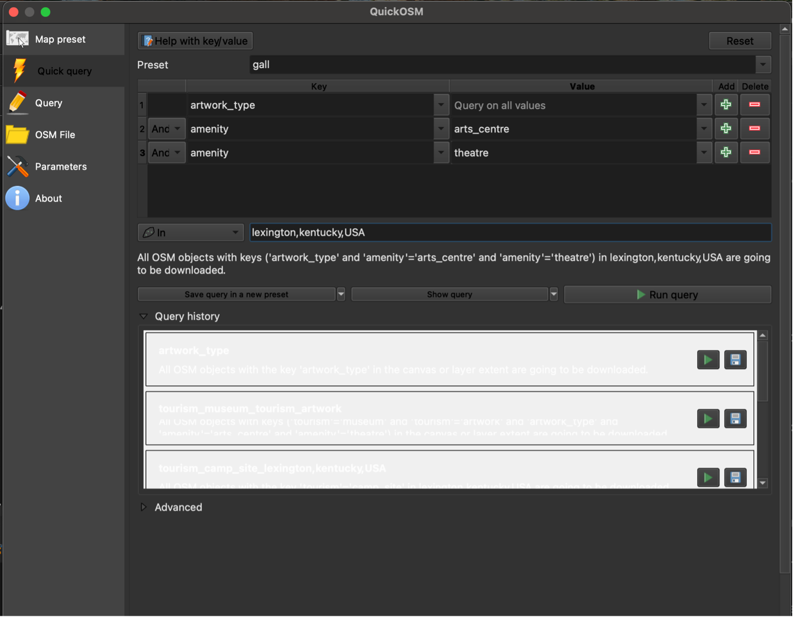
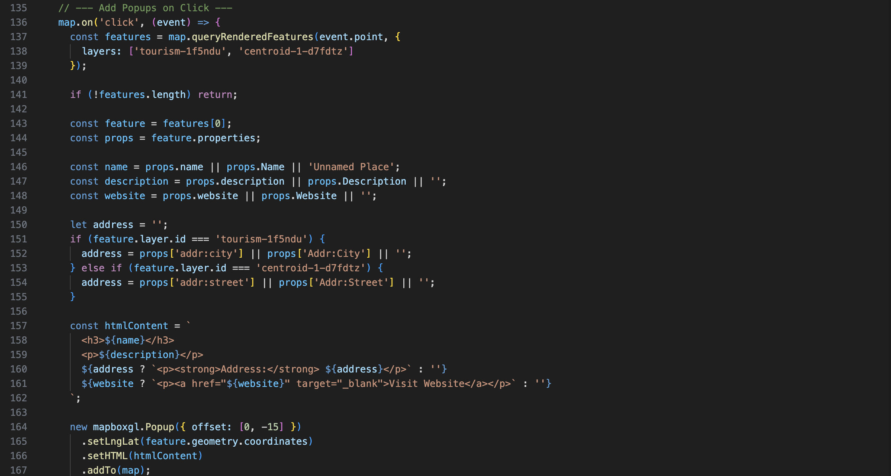

# 🗺️ Art & Culture Map of Lexington

## 📘 Project Description

This interactive map highlights the **art and culture locations** across **Lexington, Kentucky**, including murals, sculptures, galleries, theatres, and other public art installations.  
It allows users to explore cultural landmarks and view detailed information such as names, descriptions, addresses, and website links; through interactive pop-ups.

---

## 📊 Data Sources

The primary data for this project was obtained from **OpenStreetMap (OSM)** using **QGIS**.  
I extracted data using OSM keys such as `artwork:type`, `amenity`, and `leisure` to identify art and cultural features across Lexington.

Additional datasets used:
- **Lexington city boundary** – extracted from OSM using QGIS  
- **Footpath/trail network** – extracted from OSM for pedestrian routes  
- **Basemap and contextual layers** – from *Mapbox Streets v8* tileset, including:
  - Roads  
  - Water bodies  
  - Buildings  
  - Land use  
  - Place and road labels  

### 🔗 Data Access
All processed data are available in this repository in the **`/QGIS`** folder:
- `centroid_1.geojson`
- `tourism.geojson`  
- `lexington_boundary.geojson`  
- `footpath.geojson`

These layers can be opened in **QGIS** or **Mapbox Studio** for further editing or reuse.

---

## 💡 Purpose of the Map

As an art enthusiast and a new resident of Lexington, I wanted to explore and visualize the city's **public art and cultural landscape**.  
This project helped me identify how creative expressions like murals, sculptures, and theatres; are distributed across the city.  
The map aims to make these cultural sites easily discoverable for others interested in Lexington's art scene.

---

## ⚙️ Map Creation Process

This project was built using **QGIS**, **Mapbox Studio**, and **Mapbox GL JS**.  
The workflow below outlines the full process so it can be replicated for a new location.

---

### **Step 1: Data Extraction and Cleaning**
- Extracted OSM data in **QGIS** using the *QuickOSM* plugin.  
- Selected keys related to **artwork**, **amenities**, and **leisure**.  
- Downloaded **Lexington boundary** and **footpath data** from OSM.

---

### **Step 2: Attribute Table Editing**
- Converted polygon features (e.g., art galleries, theatres) into **centroids** to create point data.  
- Cleaned and formatted attribute tables.  
- Added field information for:
  - `name`
  - `description`
  - `website`
  - `addr:city` / `addr:street`
- Manually filled missing data where available.
- Deleted some unwanted fields from the attribute table.

---

### **Step 3: Data Export**
- Reprojected all data to **EPSG:4326 – WGS 84** for web compatibility.  
- Exported final datasets as **GeoJSON** files.  
- Files are stored in the `/QGIS` folder.

---

### **Step 4: Upload to Mapbox Studio**
- Uploaded all GeoJSON layers as **new tilesets** in Mapbox Studio.  
- Created a **custom pastel basemap** using *Mapbox Streets v8*.  
- Styled additional layers:
  - Roads, labels, water, and buildings for navigation
  - Soft, subtle colors to make art features stand out

---

### **Step 5: Icon Design**
- Downloaded icon images in `.png` format from free icon libraries.  
- Converted them to `.svg` format for use in Mapbox Studio.  
- Assigned icons to each art and culture feature category (mural, theatre, sculpture, gallery, etc.).

---

### **Step 6: Building the Interactive Map**
- Created `index.html` and linked Mapbox GL JS.  
- Added interactive **pop-up functionality** that displays (if information is available):
  - Name  
  - Description  
  - Address  
  - Website 
- Included a **geolocation control** and a **fullscreen map link**.

---

### **Step 7: Styling and Testing**
- Tested zoom levels and interactivity.  
- Verified pop-up information and symbol visibility.  
- Ensured subtle color contrast between basemap and cultural points.  
- Adjusted layout for readability and accessibility.

---

## 🗺️ Projection Information

| Data Type | Original Projection | Final Projection |
|------------|---------------------|------------------|
| OSM Data (via QGIS) | EPSG:3857 – Web Mercator | EPSG:4326 – WGS 84 |
| Mapbox Tileset | EPSG:3857 – Web Mercator | EPSG:4326 – WGS 84 (used in HTML) |

All final layers were standardized to **EPSG:4326** before export to ensure compatibility with Mapbox.

---

## 🔗 View the Map

- **Interactive Map (GitHub Pages):**  
  [https://vgu239.github.io/Art-Culture-Map-of-Lexington/index.html](https://vgu239.github.io/Art-Culture-Map-of-Lexington/index.html)

- **Fullscreen Map (Mapbox Style Link):**  
  [https://api.mapbox.com/styles/v1/vgu239/cmgmgjgvh00b101qe8f8mde7j.html?title=view&access_token=pk.eyJ1Ijoidmd1MjM5IiwiYSI6ImNtZzFnZjZ2ODBuczkyaW9reDFtMDU3cDYifQ.CmVzAzn4cocOb8rnpY8G5Q&zoomwheel=true&fresh=true#10/38.015193/-84.547141](https://api.mapbox.com/styles/v1/vgu239/cmgmgjgvh00b101qe8f8mde7j.html?title=view&access_token=pk.eyJ1Ijoidmd1MjM5IiwiYSI6ImNtZzFnZjZ2ODBuczkyaW9reDFtMDU3cDYifQ.CmVzAzn4cocOb8rnpY8G5Q&zoomwheel=true&fresh=true#10/38.015193/-84.547141)

---

## 🧭 Tools and Technologies

| Tool | Purpose |
|------|----------|
| **QGIS + QuickOSM** | Extract and process OSM data |
| **Mapbox Studio** | Create and style custom basemap |
| **Mapbox GL JS** | Add interactivity to the map |
| **HTML / CSS / JS** | Develop and host the web map |
| **GitHub Pages** | Host the final project |
| **Flaticon** | Source for SVG icons |

---

## 👩‍🎓 Author

**Vipasa Gupta (2025)**  
*Department of Geography, University of Kentucky – New Maps Plus Program*

---

